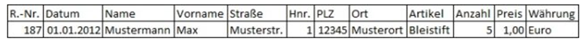
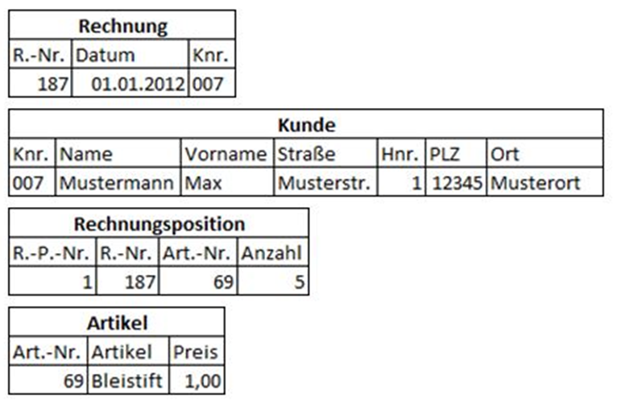

= Grundlagen der Datenbanktechnologien (Datenmodellierung, NoSQL)

== Datenmodellierung

*Entität:* Eine Entität ist ein individuelles und identifizierbares Exemplar von Dingen, Personen oder Begriffen der realen oder der Vorstellungswelt.

*Assoziation*: +

Eine Assoziation legt fest wie zwei Entitäten zusammenhängen:

* 1: genau eins
* c: keins oder eins
* m: mindestens eins
* mc: keins, eins, oder mehrere Gegenassoziation

.Gegenassoziation

=== Wertebereiche, Attribute, Formatierung

Ein Wertebereich (Domain) ist eine Menge von verschiedenen Datenwerten desselben Datentyps. +

Ein Attribut beschreibt eine bestimmte Eigenschaft der Entität einer Entitätsmenge. Diese Eigenschaftswert können nur bestimmte Werte annehmen, die in einem Wertebereich definiert sind.

=== Namensgebung

*Entität:*

* stets im Singular
* wenn möglich keine Abkürzungen
* Einheitlich bleiben (und auch konsistent)
* Begriffe der Geschäftswelt verwenden
* keine EDV-Fachausdrücke (Zielgruppe ist ja die Fachabteilung)
* Keine Synonyme (verschiedene Wörter für gleiche Begriffe) zB.: BANK, Geldinstitut
* Keine Homonyme (1 Wort mit mehreren Bedeutungen) zB.: BANK (Sitzbank, Geldinstitut)

*Assoziation:*

* Verben
* In beiden Richtungen Namen vergeben

=== Relationales Modell

anstatt Daten abstrakt (ERD) darzustellen wird im RM eine datennähere Illustration verwendet.

image::../images/image-2022-06-08-22-30-35-734.png[]

*Tupel:* Eine Tabelle ist eine Menge von Tupeln; ein Tupel ist eine Liste von Werten und entspricht einer Tabellenzeile.

=== Übergang zwischen ERD und RM

Ausgangspunkt ist ein vollständiges und richtiges ERD und Ziel ist die Darstellung der Relationen.

=== Tabelle

*Merkmale:*

* Name: eindeutiger Name
* Zeilen: hat mehrere Tupel, Reihenfolge egal da Zeileninhalt relevant ist
* Spalten: sind (eindeutige) Eigenschaften der Entität
* Werte: eine bestimmte Spalte enthält Attributwerte als Daten

=== Primärschlüssel

Jede Tabelle hat einen oder mehrere Schlüsselkandidaten, die entweder aus einem oder mehreren Werten zusammengesetzt werden kann.
Diese Kombination ermöglicht den eindeutigen Zugriff auf eine bestimmte Zeile in einer bestimmten Tabelle.
Ein Primärschlüssel ist ein festgelegter Schlüssel der Schlüsselkandidaten.
Schlüsselkandidaten, die nicht als PK definiert sind, nennt man Foreign Key (dienen als Verweis auf eine andere Tabelle)

=== Eigenschaften eines PK´s:

Schlüsselkandidaten, die nicht als PK definiert sind, nennt man Foreign Key (dienen als Verweis auf eine andere Tabelle)

* Eindeutigkeit (eh selbstverständlich)
* Kürze, Schreibbarkeit: kurz und leicht formuliert
* Sprechend: aus dem PK sollten Eigenschaften der Entität erkennbar sein. Kann im Widerspruch mit den anderen Eigenschaften eine PK sein

=== Fremdschlüssel

* FK kann Teil des PK sein
* FK kann im Gegensatz zum PK NULL sein

*Vorgehensweise:*

1.	Jede Entitätsmenge wird eine Relation mit PK (z.B.: Mitarbeiter (MitarbNR, …))
2.	1: n Beziehungen werden Fremdschlüssel
a.	Der PK der 1-Seite wird als FK in der n-Seite eingefügt
3.	m: n Beziehungen werden assoziative Tabellen
a.	assoziativ Tabelle enthält einen eigenen (oder Kombination der PK) PK und den der n- und m-Seite
4.	Eigenschaften werden zu Spalten
5.	Jede Beziehung wird zum FK
a.	1:1
b.	Rekursive Beziehungen

=== Notationen

image::../images/image-2022-06-02-16-06-47-429.png[]

=== Anomalien

Anomalien in Datenbanken treten bei einer nicht existierenden oder fehlerhaften Normalisierung auf.

==== Einfüge(Insert)-Anomalie

* Daten werden nicht in die Datenbank übernommen

==== Änderungs(Update)-Anomalie

* Gleiche Attribute werden nicht automatisch mitgeändert

==== Lösch(Delete)-Anomalie

* Informationen werden gelöscht, leider aber auch andere zusammenhängende Informationen

=== Kardinalitäten

==== 1:1 Beziehung

Jedem Datensatz aus der Tabelle A ist nur ein passender Datensatz der Tabelle B zugeordnet

==== 1:n Beziehung

In einem Datensatz können in der Tabelle A mehrere passende Datensätze der Tabelle B eindeutig zugeordnet sein, aber in einem Datensatz der Tabelle B nie mehr als ein Datensatz der Tabelle A

==== m:n Beziehung
In Tabelle A können mehrere passende Datensätzen in Tabelle B zugeordnet sein und umgekehrt.

=== Constrains

==== NULL

Legt fest, dass eine Spalte NULL sein kann (optionale Eingabe, default).

==== NOT NULL

Legt fest, dass eine Spalte nicht NULL sein kann (Pflichteingabe).

==== UNIQUE

Bestimmt eine oder mehrere Spalten als eindeutigen Schlüssel. +
Die Werte dieser Schlüsselspalten sind immer eindeutig. +
Mehrere Unique Keys sind je Tabelle definierbar. +
Für die Schlüsselspalten wird automatisch ein Index angelegt. +
Es wird so das relationale Konzept der Zweitschlüssel implementiert. +

==== PRIMARY KEY

Bestimmt eine oder mehrere Spalten als Primärschlüssel. +
Die Werte dieser Schlüsselspalten sind immer eindeutig und dürfen nicht NULL sein (implizite NOT NULL-Bedingung). Maximal ist ein Primärschlüssel je Tabelle definierbar. +
Für die Primärschlüsselspalten wird automatisch ein eindeutiger Index angelegt. +

==== FOREIGN KEY

Bestimmt eine oder mehrere Spalten als Fremdschlüssel, die Primärschlüssel in einer anderen Tabelle sind und damit der referentiellen Integrität genügen müssen. +
Foreign Keys realisieren 1:n Beziehungen aus dem ER-Modell. +
Es ist das einziges Constraint mit Fehlerkorrektur-Möglichkeit. +
Für Fremdschlüssel, die als Tabellenbedingung spezifiziert werden, muss die umfangreichere FOREIGN KEY-Syntax verwendet werden. +

==== REFERENCES

Identifiziert die Master-Tabelle der Fremdschlüsselbeziehung. +
Werden keine Spalten angegen, so werden automatisch die Primärschlüsselspalten der Master-Tabelle referenziert. +
Die Klausel gehört zum FOREIGN-KEY-Constraint. +
Als Spaltenbedingung ist diese Syntax ausreichend für die Definition eines Fremdschlüssels. +

==== CHECK

Legt eine Bedingung fest, die jeder Datensatz der Tabelle erfüllen muss. +
Bei ORACLE und DB/2 sind nur sehr eingeschränkte Suchbedingungen formulierbar, wie Vergleiche mit Konstanten bzw. zwischen zwei Spalten der zugehörigen Tabelle. +
Es sind hier nicht wie im Standard-SQL SELECT-Anfragen auf andere Tabellen möglich. +
Es ist noch nicht einmal möglich, in einem CHECK-CONSTRAINT die Systemvariable SYSDATE zu verwenden.

=== Normalformen

==== Nullte Normalform

Alle Informationen eine Tabelle sind vorhanden und noch unnormalisiert

Beispiel: Rechnungsinformation

image::../images/image-2022-06-02-16-17-04-698.png[]

==== Erste Normalform (1NF)

Eine Tabelle befindet sich in der ersten Normalform (1NF), wenn die Wertebereiche der Attribute des Relationstypen atomar sind.

.davor
image::../images/image-2022-06-02-16-17-26-533.png[]

.danach
image::../images/image-2022-06-02-16-17-31-350.png[]

==== Zweite Normalform (2NF)

Eine Tabelle befindet sich genau dann in der zweiten Normalform (2NF), wenn er sich in der ersten Normalform (1NF) befindet und jedes Nichtschlüsselattribut von jedem Schlüsselkandidaten voll funktional abhängig ist.

.davor

.danach

==== Dritte Normalform (3NF)

Ein Relationstyp befindet sich genau dann in der dritten Normalform (3NF), wenn er sich in der zweiten Normalform (2NF) befindet und kein Nichtschlüsselattribut transitiv von einem Kandidatenschlüssel abhängt.

*Transitiv Abhängig:* Eine transitive Abhängigkeit liegt dann vor, wenn Y von X funktional abhängig und Z von Y, so ist Z von X funktional abhängig.

.davor
image::../images/image-2022-06-02-16-18-33-808.png[]

.danach
image::../images/image-2022-06-02-16-18-37-952.png[]

=== BCNF

Ein Attribut A wird Determinante genannt, wenn von A ein anderes Attribut B voll funktional abhängig ist. Eine Relation ist in Boyce-Codd Normalform, wenn jedes Attribut, das eine Determinante ist, auch als Schlüssel verwendet werden könnte. Eine Relation ist dann in BCNF, wenn alle Determinanten zugleich Schlüsselkandidaten sind.

*Keine Ahnung*

== NOSQL

=== Allgemein

* Not only SQL
* Datenbanksystem mit nicht-relationalem Ansatz

=== Hauptkategorien

* Key-Value
** Redis
** Amazon Webservices – S3

* Document
** MongoDB
** CouchDB

* Wide-Column
** Cassandra
** Google Datastore

* Graph
** Neo4j
** InfiniteGraph

== ACID

ACID beschreibt Regeln und Eigenschaften zur Durchführung von Transaktionen in Datenbankmanagementsystemen.

*ACID hat nichts mit NoSql zutun!*

* Atomarität
** Alles oder nichts bei Transaktionen
* Konsistenz
** Transaktionen behalten oder erzeugen neuen gültigen Zustand
* Isolation
** Transaktionen stören sich nicht gegenseitig
* Dauerhaftigkeit
** Daten einer erfolgreichen Transaktionen dauerhaft

== CAP-Theorem

Das CAP-Theorem oder Brewers Theorem besagt, dass es in einem verteilten System unmöglich ist, gleichzeitig die drei Eigenschaften Consistency *(Konsistenz)*, Availability *(Verfügbarkeit)* und Partition Tolerance *(Ausfalltoleranz)* zu garantieren.

* Konsistenz
** Jeder Leser bekommt die aktuellsten Daten
* Verfügbarkeit
** Man bekommt immer eine Antwort
* Ausfalltoleranz
** System arbeitet auch weiter, wenn Nachrichten zu spät (oder gar nicht) ankommen

== MongoDB

* Consistency
* Partition-Tolerance
* Dokumentenorientiert (JSON)
* Schema-frei
* Open Source
* Cross-Platform

== Aufbau

1. Database
2. Collection
3. Documents
4. Fields

== JSON

Vorgänger -> XML

* JavaScript Object Notation
* Wird zum Datenaustausch verwendet
* Einfach zu lesen / schreiben / parsen / generieren
* Verschachtelungen beliebig möglich

== BSON

Binary JSON, bietet zusätzlich den Datentyp Date an

== MongoDB use cases

* Bei hohem Schreibaufkommen
* “unvorhersehbares” Schema

* Sehr große Datenbank
* Ausfallsicherheit

* Mehr Performance, da Joins vermieden werden

== Grund Befehle

*Keine Ahnung ob das kommt?*

== Fragen

====
*Referat:* Datenmodellierung

...

*Referat:* NoSQL

*Frage:* _Welche Hauptkategorien gibt es_

* Key Value
* Document
* Wide-Column
* Graph

*Frage:* _Nenne jeweils ein Bsp._

``siehe Referat``

*Frage:* _Warum wird ACID bei NoSQL verwendet_

*Antwort:* Es gehört nicht dazu. ACID hat nichts mit NoSql zutun.

*Frage:* _Welche Constrains gibt es_

* Unique
* FK
* PK +
...

*Frage:* _Welche zwei Bereiche erfühlt die MongoDB_

* Consistency
* Partition-Tolerance +
``Siege Referat, CAP-Theorem, Bild``

*Frage:* _Was war der Vorgänger von JSON_

*Antwort:* XML

*Frage:* _Grundfrage: Was is besser, Relationale DB oder NoSql_

*Antwort:* Kann man nicht sagen. Relationale Datenbanken sind "Ordentlicher" als NoSql Datenbanken.
Es kommt auf den UseCase an.

*Frage:* _Gibt es in Mongo FK_

*Antwort*: Grundsätzlich nein, weil es ja keine Relationale Datenbank ist.

====