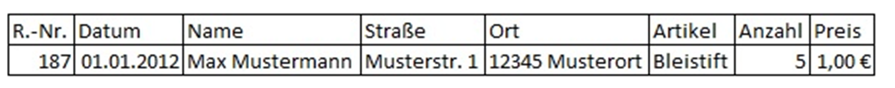
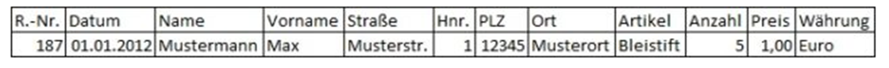
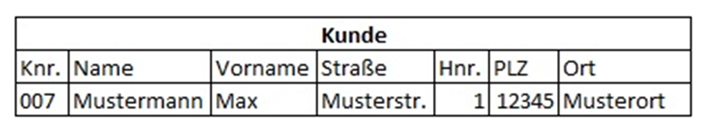
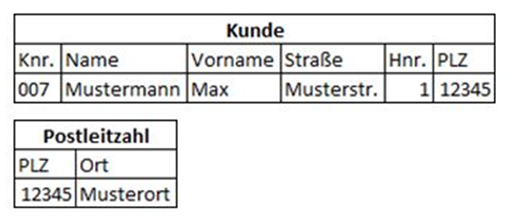
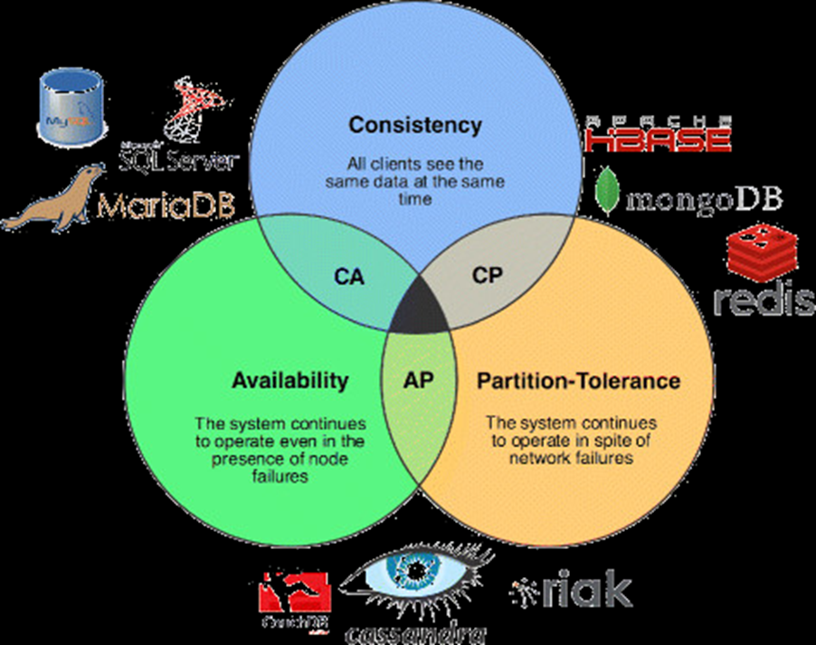
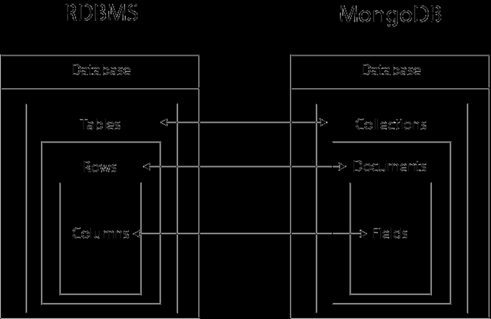

= Grundlagen der Datenbanktechnologien (Datenmodellierung, NoSQL)

== Datenmodellierung

=== ERD aus Angabe lesen

*Üben!*

=== Notationen

image::images/image-2022-06-02-16-06-47-429.png[]

=== Anomalien

Anomalien in Datenbanken treten bei einer nicht existierenden oder fehlerhaften Normalisierung auf.

==== Einfüge(Insert)-Anomalie
* Daten werden nicht in die Datenbank übernommen

==== Änderungs(Update)-Anomalie
* Gleiche Attribute werden nicht automatisch mitgeändert

==== Lösch(Delete)-Anomalie
* Informationen werden gelöscht, leider aber auch andere zusammenhängende Informationen

=== Kardinalitäten

==== 1:1 Beziehung

Jedem Datensatz aus der Tabelle A ist nur ein passender Datensatz der Tabelle B zugeordnet

==== 1:n Beziehung

In einem Datensatz können in der Tabelle A mehrere passende Datensätze der Tabelle B eindeutig zugeordnet sein, aber in einem Datensatz der Tabelle B nie mehr als ein Datensatz der Tabelle A

==== m:n Beziehung
In Tabelle A können mehrere passende Datensätzen in Tabelle B zugeordnet sein und umgekehrt.

=== Constrains

==== NULL

Legt fest, dass eine Spalte NULL sein kann (optionale Eingabe, default).

==== NOT NULL

Legt fest, dass eine Spalte nicht NULL sein kann (Pflichteingabe).

==== UNIQUE

Bestimmt eine oder mehrere Spalten als eindeutigen Schlüssel. +
Die Werte dieser Schlüsselspalten sind immer eindeutig. +
Mehrere Unique Keys sind je Tabelle definierbar. +
Für die Schlüsselspalten wird automatisch ein Index angelegt. +
Es wird so das relationale Konzept der Zweitschlüssel implementiert. +

==== PRIMARY KEY

Bestimmt eine oder mehrere Spalten als Primärschlüssel. +
Die Werte dieser Schlüsselspalten sind immer eindeutig und dürfen nicht NULL sein (implizite NOT NULL-Bedingung). Maximal ist ein Primärschlüssel je Tabelle definierbar. +
Für die Primärschlüsselspalten wird automatisch ein eindeutiger Index angelegt. +

==== FOREIGN KEY

Bestimmt eine oder mehrere Spalten als Fremdschlüssel, die Primärschlüssel in einer anderen Tabelle sind und damit der referentiellen Integrität genügen müssen. +
Foreign Keys realisieren 1:n Beziehungen aus dem ER-Modell. +
Es ist das einziges Constraint mit Fehlerkorrektur-Möglichkeit. +
Für Fremdschlüssel, die als Tabellenbedingung spezifiziert werden, muss die umfangreichere FOREIGN KEY-Syntax verwendet werden. +

==== REFERENCES

Identifiziert die Master-Tabelle der Fremdschlüsselbeziehung. +
Werden keine Spalten angegen, so werden automatisch die Primärschlüsselspalten der Master-Tabelle referenziert. +
Die Klausel gehört zum FOREIGN-KEY-Constraint. +
Als Spaltenbedingung ist diese Syntax ausreichend für die Definition eines Fremdschlüssels. +

==== CHECK

Legt eine Bedingung fest, die jeder Datensatz der Tabelle erfüllen muss. +
Bei ORACLE und DB/2 sind nur sehr eingeschränkte Suchbedingungen formulierbar, wie Vergleiche mit Konstanten bzw. zwischen zwei Spalten der zugehörigen Tabelle. +
Es sind hier nicht wie im Standard-SQL SELECT-Anfragen auf andere Tabellen möglich. +
Es ist noch nicht einmal möglich, in einem CHECK-CONSTRAINT die Systemvariable SYSDATE zu verwenden.

=== Normalformen

==== Nullte Normalform

Alle Informationen eine Tabelle sind vorhanden und noch unnormalisiert

Beispiel: Rechnungsinformation

==== Erste Normalform (1NF)

Eine Relation ist in der 1 NF, wenn alle Attributwerte atomar sind.

.davor
image::images/image-2022-06-02-16-17-26-533.png[]

.danach

==== Zweite Normalform (2NF)

Eine Relation ist in der 2NF, wenn alle Nichtschlüsselattributwerte vom gesamten Primärschlüssel abhängig sind

.davor
image::images/image-2022-06-02-16-17-45-327.png[]

.danach
image::images/image-2022-06-02-16-18-15-002.png[]

==== Dritte Normalform (3NF)

Eine Relation ist in der 3NF, wenn alle Nichtschlüsselattributwerte voneinander unabhängig sind.

.davor

.danach

=== BCNF

*Keine Ahnung*

== NOSQL

=== Allgemein

* Not only SQL
* Datenbanksystem mit nicht-relationalem Ansatz

=== Hauptkategorien

* Key-Value
** Redis
** Amazon Webservices – S3

* Document
** MongoDB
** CouchDB

* Wide-Column
** Cassandra
** Google Datastore

* Graph
** Neo4j
** InfiniteGraph

== ACID

ACID beschreibt Regeln und Eigenschaften zur Durchführung von Transaktionen in Datenbankmanagementsystemen.

*ACID hat nichts mit NoSql zutun!*

* Atomarität
** Alles oder nichts bei Transaktionen
* Konsistenz
** Transaktionen behalten oder erzeugen neuen gültigen Zustand
* Isolation
** Transaktionen stören sich nicht gegenseitig
* Dauerhaftigkeit
** Daten einer erfolgreichen Transaktionen dauerhaft

== CAP-Theorem

Das CAP-Theorem oder Brewers Theorem besagt, dass es in einem verteilten System unmöglich ist, gleichzeitig die drei Eigenschaften Consistency *(Konsistenz)*, Availability *(Verfügbarkeit)* und Partition Tolerance *(Ausfalltoleranz)* zu garantieren.

* Konsistenz
** Jeder Leser bekommt die aktuellsten Daten
* Verfügbarkeit
** Man bekommt immer eine Antwort
* Ausfalltoleranz
** System arbeitet auch weiter, wenn Nachrichten zu spät (oder gar nicht) ankommen

== MongoDB

* Consistency
* Partition-Tolerance
* Dokumentenorientiert (JSON)
* Schema-frei
* Open Source
* Cross-Platform

== Aufbau

1. Database
2. Collection
3. Documents
4. Fields

== JSON

Vorgänger -> XML

* JavaScript Object Notation
* Wird zum Datenaustausch verwendet
* Einfach zu lesen / schreiben / parsen / generieren
* Verschachtelungen beliebig möglich

== MongoDB use cases

* Bei hohem Schreibaufkommen
* “unvorhersehbares” Schema

* Sehr große Datenbank
* Ausfallsicherheit

* Mehr Performance, da Joins vermieden werden

== Grund Befehle

*Keine Ahnung ob das kommt?*

== Fragen

====
*Referat:* Datenmodellierung

...

*Referat:* NoSQL

*Frage:* _Welche Hauptkategorien gibt es_

* Key Value
* Document
* Wide-Column
* Graph

*Frage:* _Nenne jeweils ein Bsp._

``siehe Referat``

*Frage:* _Warum wird ACID bei NoSQL verwendet_

*Antwort:* Es gehört nicht dazu. ACID hat nichts mit NoSql zutun.

*Frage:* _Welche Constrains gibt es_

* Unique
* FK
* PK +
...

*Frage:* _Welche zwei Bereiche erfühlt die MongoDB_

* Consistency
* Partition-Tolerance +
``Siege Referat, CAP-Theorem, Bild``

*Frage:* _Was war der Vorgänger von JSON_

*Antwort:* XML

*Frage:* _Grundfrage: Was is besser, Relationale DB oder NoSql_

*Antwort:* Kann man nicht sagen. Relationale Datenbanken sind "Ordentlicher" als NoSql Datenbanken.
Es kommt auf den UseCase an.

*Frage:* _Gibt es in Mongo FK_

*Antwort*: Grundsätzlich nein, weil es ja keine Relationale Datenbank ist.

====