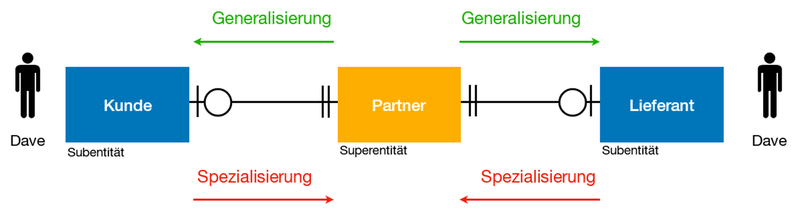
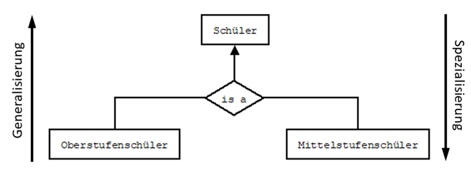
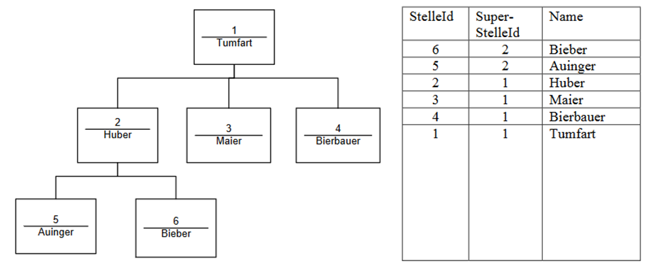
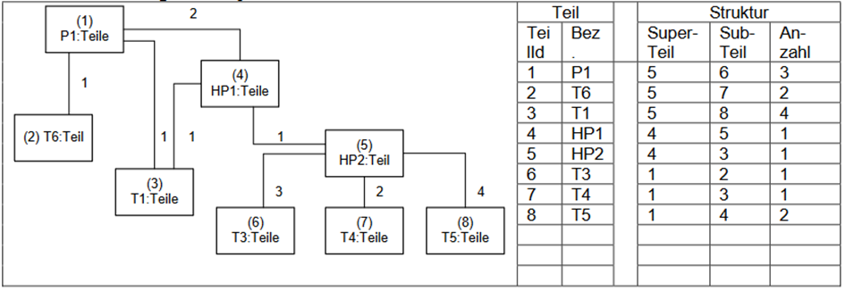

= Konzeptionelles Modell

== ERD

link:https://davidenkovic.github.io/dbi-matura/pool-1.html[Grundlagen der Datenbanktechnologien]

== Subtypen, Supertypen, Generalisierung , Spezialisierung

=== Subtypen, Supertypen

* Supertyp -> properties von der Basisklasse
* Subtyp -> properties von klassen welcher von Basisklasse erbt bzw. diese beinhaltet

=== Generalisation

Wenn die Entitäten, die zur Erstellung eines Schemas herausgefunden werden, einige ähnliche Funktionen gemeinsam nutzen, werden sie zu einer übergeordneten Entität zusammengefasst.

=== Spezialisierung

In der Spezialisierung teilen wir eine Entität auf, um mehrere Entitäten niedrigerer Ebene zu bilden. Diese neu gebildeten Entitäten der unteren Ebene erben einige Merkmale der Entitäten der höheren Ebene.

== Constrains

link:https://davidenkovic.github.io/dbi-matura/pool-1.html[Grundlagen der Datenbanktechnologien]

== Kardinalitäten

link:https://davidenkovic.github.io/dbi-matura/pool-1.html[Grundlagen der Datenbanktechnologien]

== Organisation

* EMP Tabelle

== Stückliste

* Rad besteht aus schrauben

== Konzeptuelles Schema

Logische Gesamtstruktur der Daten, Eigenschaften und Beziehungen +
Elemente des Schemas:

* Beschreibung der logischen Daten und der darin enthaltenen Record-Typen
** Z.B.: Mitarbeiter (ID, Name, …)
* Beschreibung der Felder, die in einem bestimmten Satztyp vorkommen
** ID = ganze Zahl, Name = String 20 Zeichen lang
* Beschreibung der Beziehungen (Relationen) zwischen den logisch zusammengehörenden Satztypen
** Beziehung zwischen Mitarbeiter und Abteilung
* Beschreibung der Gültigkeitsbereiche einzelner Felder
** Beschränkungen auf Attribute
