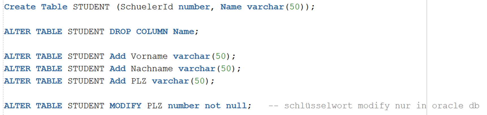
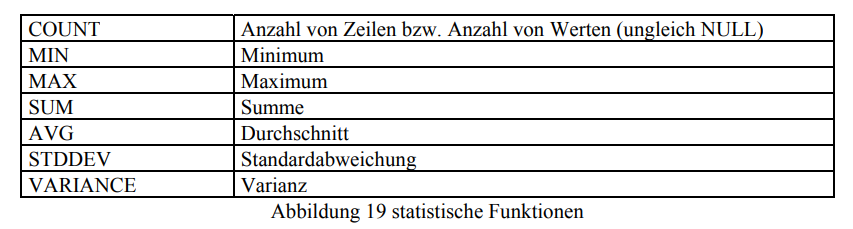
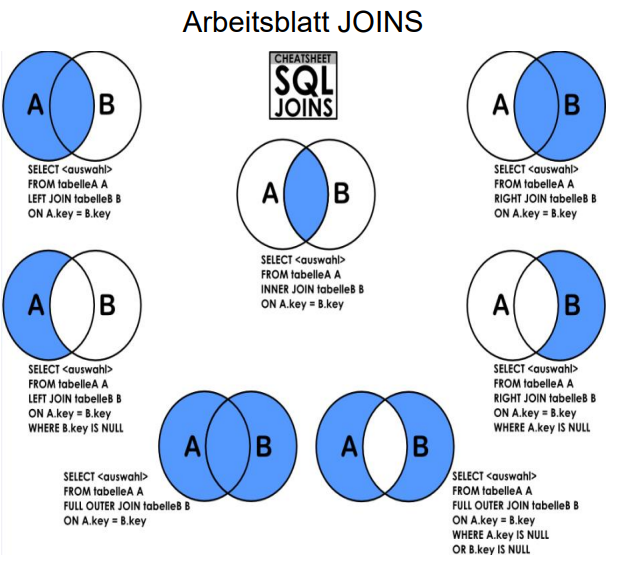
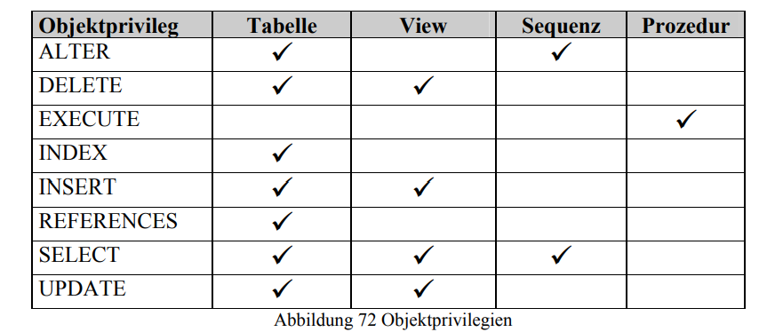

= SQL Data Retrieval und DML

== Manipulation

=== INSERT

.version 1
[source,sql]
----
INSERT INTO dept (deptno, dname)
 VALUES (60, 'MIS');
----

.version 2
[source,sql]
----
INSERT INTO dept
 VALUES (60, 'MIS', NULL);
----

=== UPDATE

[source,sql]
----
UPDATE table_name
SET column1 = value1, column2 = value2, ...
WHERE condition;
----

=== DROP

Löscht die Tabelle

[source,sql]
----
DROP TABLE TABLE_NAME;
----

=== DELETE

Löscht eine Spalte aus der Tabelle aus.

[source,sql]
----
DELETE FROM table_name WHERE condition;
----

=== ALTER TABLE

Dient zur bearbeitung von Tabellen.

=== Truncate

Löscht die Daten einer Tabelle, nicht die Tabelle

[source,sql]
----
TRUNCATE Table TABLE_NAME;
----

== SELECT

[source,sql]
----
SELECT ....
FROM ....
[WHERE ....]
[CONNECT BY ....]
[GROUP BY ....
[HAVING ....]]
[ORDER BY ....]

----

=== Statische Funktionen

== View

[source,sql]
----
CREATE VIEW v_players AS
SELECT p.playerno,name,sum(amount) AS amount_total
FROM players p, penalties pe
WHERE p.playerno = pe.playerno(+)
GROUP BY p.playerno,name;
----

== JOIN

=== Natural JOIN

.version 1
[source,sql]
----
select emp.ENAME,dept.DNAME from emp, dept
where emp.deptno=dept.DEPTNO;
----

.version 2
[source,sql]
----
select d.deptno,e.ENAME,d.DNAME from emp e,
dept d where e.deptno=d.DEPTNO;
----

=== Cross JOIN

.version 1
[source,sql]
----
select * from dept,emp
----

.version 2
[source,sql]
----
select * from emp cross join dept;
----

=== USING

.version 1
[source,sql]
----
select emp.ENAME,dept.DNAME from emp Join
dept using (deptno);
----

.version 2
[source,sql]
----
select emp.ENAME,dept.DNAME from emp
Join dept using (deptno,deptno);
----

=== ON

.version 1
[source,sql]
----
select emp.ENAME,dept.DNAME from emp
Join dept on (dept.deptno=emp.deptno);
----

== Subselect

.version 1
[source,sql]
----
SELECT * FROM players
WHERE EXISTS (SELECT * FROM penalties WHERE
playerno=players.playerno);
----

.version 2
[source,sql]
----
select playerno, name
from players p
where not exists
    (select *
    from penalties
    where playerno = p.playerno
      and amount <= 50)
and exists
    (select *
    from penalties
    where playerno = p.playerno);
----

== Group By

[source,sql]
----
SELECT name, initials, SUM(amount) FROM players pl, penalties pe
WHERE pl.playerno = pe.playerno GROUP BY name, initials
----

== Objektprivilegien

== Notes

----
systemvariablen
- select sysdate from dual
- select user from dual
- select rownum, name from players

nummerische ausdrücke
- select 3+4*2 from dual => ERgebniss: 1 zeile: 11, weil dual nur 1 zeile hat
- select 3+4*2 from players (players hat 5 einträge) => 1.-5. zeile 11

Alphanummerische Ausdrücke
- || => concatinieren
- concat() is ds gleiche

Scalarfunktionen
- Length
- Decode

Date
- Alter NLS_Format ....
- TO_DATE für eingabe
- TO_CHAR für ausgabe

Klauseln
- WHERE => bezieht sich auf alle zeilen
- LIKE Wildcards:
- % => alle darauffolgenden zeichen
- _ => einzelnes zeichen
- BSP: WHERE name LIKE 'a%'
- GROUP BY => HAVING bezieht sich auf die gruppen/gruppierung
- ORDER BY => ASC, DESC

Gruppenfunktion:
- SUM
- MIN
- MAX
- AVG
- COUNT

Constraints
- not null
- unique
- PK
- FK
- check
- default
- create_index

Rechte
- grant

Subquery:
- IN
- ALL
- ANY
- EXISTS

JOINS:
- emp,dept join => kartesisches produkt
- über PK und FK wird gejoint
----