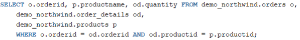

= SQL DCL und DDL

== Constraints

* NULL
* NOT NULL
* UNIQUE
* PRIMARY KEY
* FOREIGN KEY
* REFERENCES
* CHECK

== Views

[source,sql]
----
CREATE VIEW v_players AS
SELECT p.playerno,name,sum(amount) AS amount_total
FROM players p, penalties pe
WHERE p.playerno = pe.playerno(+)
GROUP BY p.playerno,name;
----

== Optimierungen

* SELECT * vermeiden
* SELECT DISTINCT nicht benutzen
* Inner Join benutzen statt WHERE
* HAVING vermeiden, weil man WHERE braucht
* Indizes benutzen

Tabellen sollte man mit einem Inner Join und nicht über eine WHERE-Klausel durchführen.

Den mit diesem Join wird ein Kartesisches Produkt erzeugt, dies bedeutet, dass jede Spalte
mit jeder Spalte multipliziert wird.
Daraus folgt, dass die Datenbank viel mehr arbeiten muss als nötig.
Um diese unnötige Arbeit zu vermeiden sollte man bei solchen Joins immer einen Inner Join benutzten, da dieser nur die nötigen Zeilen zurückgibt.

=== Index

Ein Datenbankindex, oder kurz Index, ist eine von der Datenstruktur getrennte Indexstruktur in einer Datenbank, die die Suche und das Sortieren nach bestimmten Feldern beschleunigt.

=== Oracle-Optimizer

Der Oracle Query Optimizer ist ein integriertes Datenbank-Tool, dass bei der Optimierung
von SQL-Abfragen in Oracle Datenbanken hilft, in dem es die effizienteste Methode
herausfindet eine Abfrage durchzuführen.

Es werden mehrere Ausführungspläne sowie die Kosten einzelner Abfragen generiert und
verglichen. Zum Vergleich werden Query Blocks verwendete, diese sind eine geparste
Darstellung einer SQL-Abfrage.

Der Oracle-Optimizer geht nach folgendem Schema vor:

* Es werden Ausführungspläne für ein SQL-Statement generiert
* Die Kosten dieser Ausführungspläne werden aufgrund von Statistiken zur Datengröße und Speicher-Charakteristiken der Tabellen und Indizes berechnet.
* Zuletzt werden diese Kosten verglichen und es wird der Plan mit den geringsten Kosten ausgeführt.

Wenn man eine Abfrage hat, die alle Manager einer Firma zurückgeben soll, hat der Oracle
Optimizer in diesem Beispiel zwei Möglichkeiten: den Index zu benutzen oder einen vollen
Scan der Tabelle vorzunehmen und jede Zeile einzeln zu überprüfen.

=== Regelbasierter Optimierer

Oracle rät stark von der Nutzung des regelbasierten Optimierer ab, da er überholt ist und in zukünftigen Release entfernt wird.
Der Regelbasierte Optimierer benutzt verschiedene vordefinierte Regel, um eine Abfrage zu optimieren.
Eine solche Regel, wäre zum Beispiel: Ist ein Index auf eine Tabelle vorhanden so nimmt der Regelbasierte Optimierer immer den Index, auch wenn ein kompletter Scan der Tabelle effizienter wäre.

*Wurde von Kostenbasierten Optimierer ersetzt*

=== Kostenbasierter Optimierer

Wenn eine Abfrage an die Datenbank gesendet wird, ist es die Aufgabe des SQL-Optimierers, herauszufinden, wie die Abfrage ausgeführt werden soll, und dieser
Prozess erstellt den Ausführungsplan der Abfrage.

Ein Execution Plan ist wie ein Baum aufgebaut, ein SELECT Statement is die Wurzel, die Tabellen sind die Blätter und dazwischen können viele verschiedene Operationen sein.
Es gibt drei verschiedene Arten von Operationen:

*Besteht aus Query Transformer, Estimator und Plan Generator*

=== Execution Plans

* Wird vom Optimierer erstellt wenn eine Query an die Datenbank
geschickt wird

* Mehrere Operationen
** Single-Child Operationen, Multi-Child Operationen und Joins

=== EXPLAIN PLAN

* Wird verwendet, um den Execution Plan einer Abfrage zu erstellen
* Speichert den Plan in eine eigene Tabelle

=== SQL Hints

SQL Hints sind dazu da, um den Optimierer beeinflussen zu können.
Sie werden in Form von Kommentaren geschrieben, bei denen das erste Zeichen ein Plus (+) ist.

* merge / no_merge
* push_pred / no_push_pred
* unnest / no_unnest
* push_subq / no_push_subq
* driving_site

== Rollen/User

* CREATE USER

* Grant: verteilt Rechte an User
* Revoke: nimmt die Rechte weg

== System privilege

A system privilege is the right to perform a particular action or to perform an action on any object of a particular type. Objects include tables, views, materialized views, synonyms, indexes, sequences, cache groups, replication schemes and PL/SQL functions, procedures and packages. Only the instance administrator or a user with ADMIN privilege can grant or revoke system privileges

== Fragen

====

*Frage:* Es gibt DDL und DCL. Welche gibt es noch?

*Antwort:* DQL(SQL) und DML gibt es auch noch

*Frage:* Gibt es noch eine möglichkeit zu löschen?

*Antwort:* Truncate

*Frage:* Welche Constrains gibt es noch

*Antwort:*

* PK
* FK
* Not Null
* Unique
* Check
* Default
* Create Index

*Frage:* WO kann man constraints hinschreiben

*Antwort:* Nach dem Attribut (Column Constrains) und Table Constrains bei zusammengesetzte

*Frage:* Was ist ein zusammengesetzte PK

*Antwort:* 2 Attribute bilden einen zusammengesetzte PK und werden eindeutig.

*Frage:* Kann man Datentypen ändern, wenn schon daten drin sind z.B. varchar zu number?

*Antwort:* Nein nicht direkt, weil Daten schon drin sind geht es nicht. Man könnte aber die Spalte Kopieren in eine andere und die alte dann löschen.

*Frage:* Was macht Truncate

*Antwort:* Löscht die Daten, nicht die Tabelle.

*Frage:* Womit kann man Truncate vergleichen und was is der Unterschied?

*Antwort:* Delete From, bei Delete From gibt es ein Where. Truncate hat das nicht.

*Frage:* Gibt es einen Mistkübel in Oracle beim Löschen (Tabelle zurückhollen)

*Antwort:* Ja, Recycle Bin

*Frage:* Was ist eine View

*Antwort:* Virtuelle Tabelle dient zur Veranschaulichung

*Frage:* Wie kann man verhindern eine Tabelle zu sehen

*Antwort:* Mit rechten

*Frage:* Welcher Index bei einer Tabelle ist Standart

*Antwort:* ID

*Frage:* Wofür wird Index verwendet

*Antwort:* Es ist viel schneller.

*Frage:* Was macht Revoke?

*Antwort:* Gegenteil von Grant

*Frage:* Wie kann man die Rechte weitergeben?

*Antwort:* ... with option

*Frage:* Was macht checkt Constraints

*Antwort:* Mann kann sagen das z.B. der User nicht älter als 18 sein darf. Also überprüfung in der DB.

====

== Notes

----
- was ist ein index
Ein Datenbankindex, oder kurz Index, ist eine von der Datenstruktur getrennte Indexstruktur in einer Datenbank, die die Suche und das Sortieren nach bestimmten Feldern beschleunigt

- welche automatischen indezes gibt es
primary key

- Was ist distinct
doppellete werte werden rausgefiltert

- kostenbasierter optimierer, was bedeutet kosten
zeit, resourcen, mischung aus mehreren parameter

- explain plan keyword -> erstellt execution plan für ein select statement

- was ist ein hint?
mit einem hint übersteuert man die sql optimierer

- sql hint -> beginnt mit /*+ .... */

- was erkennt man an einem hint?
dass jemand in einen optimierer ein eingreift

- wie optimiert man sql statement
hints, reihenfolger der joins, indezes, kein distinct
----