= Semistrukturierte Daten und prozedurale Erweiterung

== XML

* e *X* tensible *M* arkup *L* anguage
* Texbasiertes Datenformat ähnlich wie JSON
* Enstand aus der Not da HTML an seine grenzen stoßte
* Häufig zum Datenaustausch über das Internet
* Ist designed um Daten beförden nicht um sie zu veranschaulichen
* Verwendet keine vordefinierten Tags wie 
, <h1>, etc.
* Der Autor muss die Struktur und tags definieren

[source,xml]
----
<player>
    <name>Dave</name>
    <age>18</age>
</player>
----

=== DTD

Definiert die Struktur und die Elemente und Attribute eines XML-Dokuments

[source,dtd]
----
<!DOCTYPE note
[
<!ELEMENT note (to,from,heading,body)>
<!ELEMENT to (#PCDATA)>
<!ELEMENT from (#PCDATA)>
<!ELEMENT heading (#PCDATA)>
<!ELEMENT body (#PCDATA)>
]>
----

=== DTD für Entity

[source,dtd]
----
<?xml version="1.0" encoding="UTF-8"?>

<!DOCTYPE note [
<!ENTITY nbsp "&#xA0;">
<!ENTITY writer "Writer: Donald Duck.">
<!ENTITY copyright "Copyright: W3Schools.">
]>

<note>
<to>Tove</to>
<from>Jani</from>
<heading>Reminder</heading>
<body>Don't forget me this weekend!</body>
<footer>&writer;&nbsp;&copyright;</footer>
</note>
----

=== XML Schema

Alternative zu DTD mit einigen Vorteilen:

* In XML geschrieben
* Unterstützt Datentypen
* Unterstützt XML Namespaces
* Erweiterbar

[source,xml]
----
<xs:element name="note">

<xs:complexType>
  <xs:sequence>
    <xs:element name="to" type="xs:string"/>
    <xs:element name="from" type="xs:string"/>
    <xs:element name="heading" type="xs:string"/>
    <xs:element name="body" type="xs:string"/>
  </xs:sequence>
</xs:complexType>

</xs:element>
----

=== SVG (Scalable Vector Graphics)

Ist eine XML-basierte Markup Language zu beschreibung von 2 Dimensionalen Vektor Grafiken

[source,xml]
----
<svg width="300" height="200" viewbox="0 0 3 2">
 ...
</svg>
----

=== AJAX - Asynchronous JavaScript And XML

* Update eine web page ohne sie neu zu laden
* Daten von einem Server anfordern - nachdem die Seite geladen wurde
* Empfangen von Daten von einem Server - nachdem die Seite geladen wurde
* Daten an einen Server senden - im Hintergrund

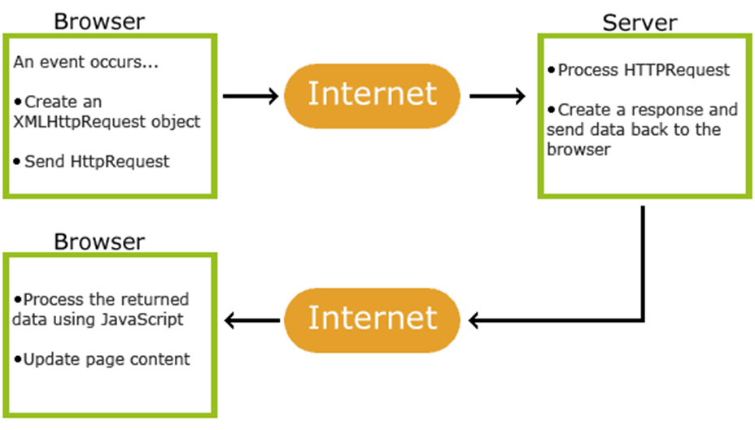

[source,xml]
----
<!DOCTYPE html>
<html>
<body>

<h1>The XMLHttpRequest Object</h1>
<button type="button" onclick="loadDoc()">Change Content</button>

</body>
</html>
----

=== DOM – Document Object Model

* Ein Standardobjektmodell für XML
* Eine Standard-Programmierschnittstelle für XML
* Plattform- und sprachunabhängig
* Ein W3C-Standard
* Stellt ein XML-Dokument als Baumstruktur dar

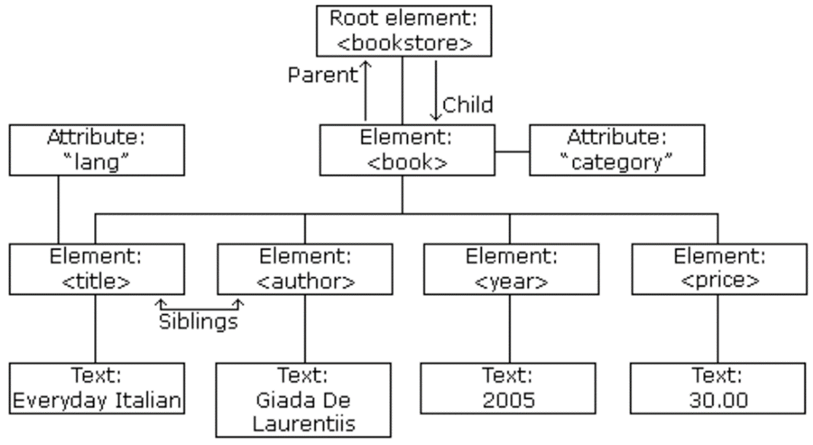

=== SAX – Simple API for XML

Ist eine ereignisorientierte Schnittstelle zum Parsenvon XML-Dokumenten. Im Unterschied zu DOM ist sie ereignisorientiert. Nahezu alle neueren XML-Parser enthalten eine SAX-Implementierung, unter anderem *Xerces* für Java.

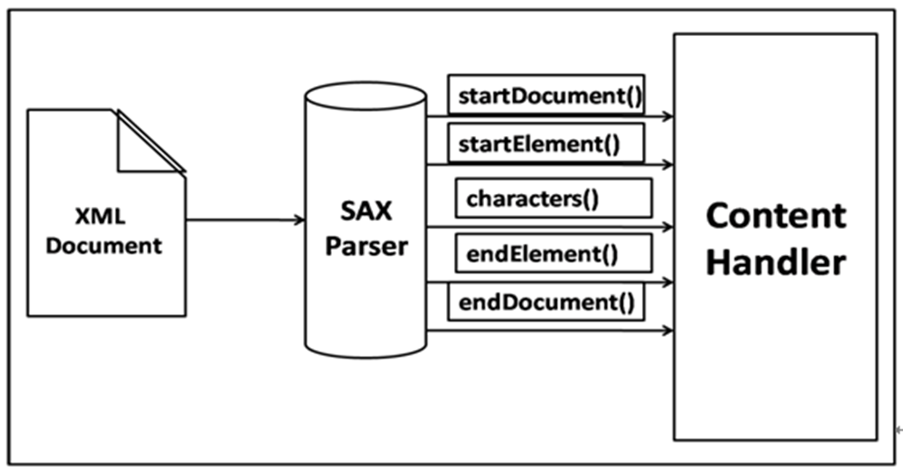

== PL-SQL

* Vereint das normale SQL mit Eigenschaften einer echten Programmiersprache, die aus verschiedenen Prozeduren bestehen und modular aufgerufen werden kann.
* Zusammenfassen von Prozeduren zu Modulen (PACKAGES) ist möglich.
* PL-SQL Prozeduren können in der Datenbank abgelegt werden und von sämtlichen Benutzern mit entsprechenden Rechten ausgeführt werden.
* Erhöhung der Effizienz der Softwarentwicklung im Datenbankbereich

=== Prozedur

Ist ein benannter SQL-Block, der eine oder mehr Anweisungen ausführt. Daten können durch die Parameter-Liste an die Prozedur übergeben  bzw. von der Prozedur erhalten werden.

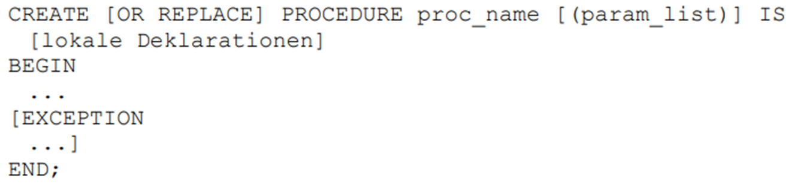

=== Funktion

Ein benannter SQL-Block, der einen Einzelwert zurückgibt und kann wie ein PL/SQL-Ausdruck aufgerufen werden.
Funktionen und Prozeduren sind ident strukturiert, bis auf die in der Funktion enthaltene RETURN-Klausel.

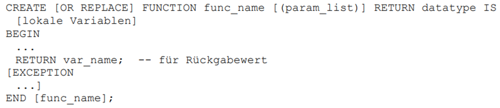

=== Package

Ist eine benannte Sammlung von Prozeduren, Funktionen, Typen und Variablen.

=== Ausführung einer Stored Procedure/ Function

*Aus Rumpf einer anderen Prozedur*

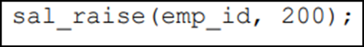

*Unter Verwendung eines anonymen PL/SQL Bockes:*

image::images/image-2022-06-09-17-02-14-361.png[]

*unter EXECUTE Kommandos:*

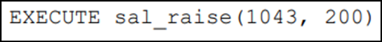

*Verwendung von stored functions (ähnlich wie built-in functions)*

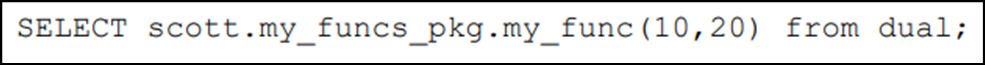

=== Exceptions

==== Syntax

* System-defined exceptions
* User-defined exceptions

[source,sql]
----
DECLARE
   <declarations section>
BEGIN
   <executable command(s)>
EXCEPTION
   <exception handling goes here >
   WHEN exception1 THEN
      exception1-handling-statements
   WHEN exception2  THEN
      exception2-handling-statements
   WHEN exception3 THEN
      exception3-handling-statements
   ........
   WHEN others THEN
      exception3-handling-statements
END

/

DECLARE
   c_id customers.id%type := 8;
   c_name customerS.Name%type;
   c_addr customers.address%type;
BEGIN
   SELECT  name, address INTO  c_name, c_addr
   FROM customers
   WHERE id = c_id;
   DBMS_OUTPUT.PUT_LINE ('Name: '||  c_name);
   DBMS_OUTPUT.PUT_LINE ('Address: ' || c_addr);

EXCEPTION
   WHEN no_data_found THEN
      dbms_output.put_line('No such customer!');
   WHEN others THEN
      dbms_output.put_line('Error!');
END;

----

==== Raising Exceptions

Hier ist das *Raise* wichtig.

[source,sql]
----
DECLARE
   exception_name EXCEPTION;
BEGIN
   IF condition THEN
      RAISE exception_name;
   END IF;
EXCEPTION
   WHEN exception_name THEN
   statement;
END;
----

==== User-defined Exceptions

[source,sql]
----
DECLARE
my-exception EXCEPTION;
----

==== Pre-defined Exceptions

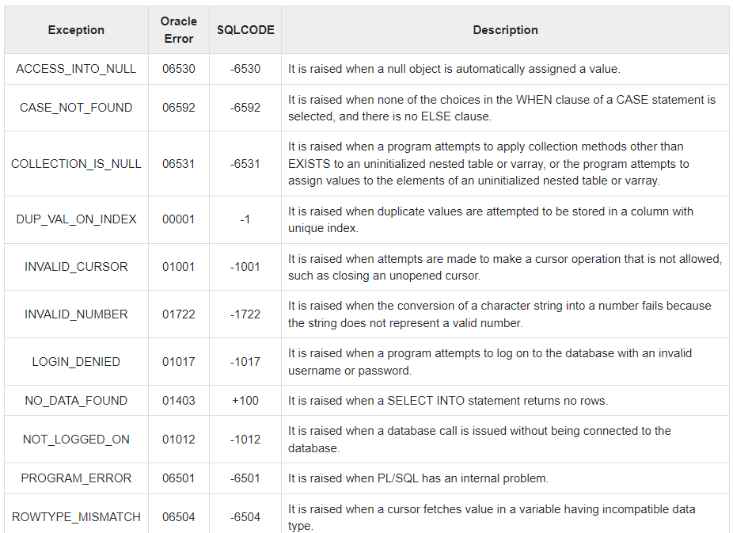

=== Trigger

Ein Trigger ist eine gespeicherte Prozedur in der Datenbank, die automatisch aufgerufen wird, wenn ein spezielles Ereignis in der Datenbank auftritt.

*DML-Trigger* werden bei Insert-, Update- oder Delete-Statements verwendet, also immer dann, wenn ein Datensatz hinzugefügt, bearbeitet oder gelöscht werden soll.

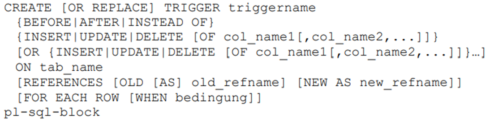

*DDL-Trigger* werden immer dann verwendet, wenn die grundlegende Struktur  einer Datenbanktabelle verändert wird.

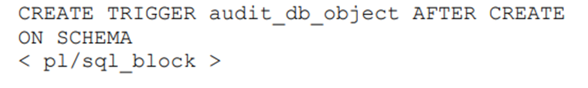

=== Jobs

* Zeitgesteuerte Events

== JPA

link:https://davidenkovic.github.io/school-notes/jpa-test.html[JPA]

== R

*Bro keine Ahnung*

== Apex

* Eine Low-Code Entwicklungsplattform
** Auswählen von verschiedenen UI Elementen, Drag and Drop, wenig Code (mehr allerdings möglich)
* 2004 mit dem Namen HTML Db von Oracle veröffentlicht
* Läuft in der Oracle Datenbank, und ist auch Teil der normalen Oracle Datenbank Lizenz

=== 3-Stufen Architektur*

* Browser
* Web Server
* Datenbank

=== Ablauf

1. Browser schickt eine Http-Anfrage an den Web Server
2. Http-Anfragen werden zu entsprechenden PLSQL-Anfragen übersetzt
3. Datenbank liefert die Metadaten zur Page zurück an den Server
4. Server leitet sie weiter zum Web Browser
5. Verarbeitung und Anzeige der Applikation

=== Data Schemas

Beschreibt Tabellen und dessen Beziehungen

=== Oracle Apex Engine

* Zuständig für das Rendern und Verarbeiten von Pages
* Managen von Sessions
* Authentication
* Authorization
* Validation

=== Application

* Ansammlung an Pages welche miteinander verlinkt sind (anhand von Navigation Menus, Buttons,...)
* Pages teilen sich eine Session und Authentifizierung

=== Pages

* Eine Application besitzt eine oder mehrere Pages
* Eine Page wiederum besitzt Items welche in Regions gruppiert sind
* Duch das Navigationsmenü kann man durch verschiedene Pages wechseln, oder durch Verlinkungen

=== Region

* Wird verwendet um Items zu gruppieren
* Kann/Wird auch zum Anzeigen von Daten verwendet werden
** Tree
** Report
** Charts
** …
* Aussehen kann anhand von Region Templates angepasst werden.

=== Region - Tree

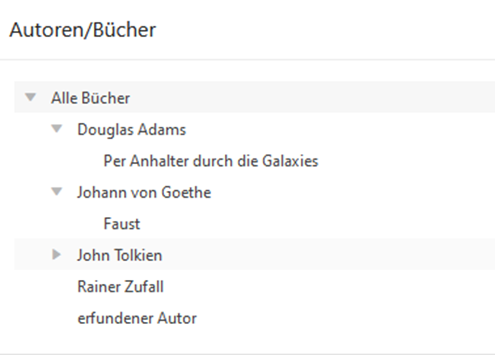

Besteht aus mehreren Ästen, welche wiederum mehrere Blätter haben

* 1: Stamm
* -1: Ast
* 0: Blatt

=== Tree

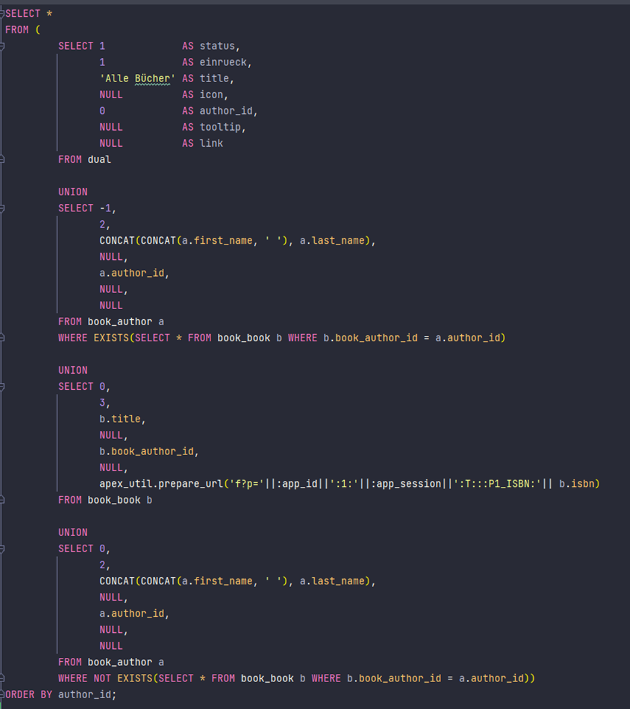

== Notes

.XML
----
Referat XML:
	- DTD Document Type Definition (alt)
		DEfinition die elemente, attribute, entities, etc.. vereinbart, die in einem xml dokument
		enthalten sein dürfen bzw. müssen, ist in eigener Syntax verfasst
	- XML Schema (neu)
		Definition liegt im XML schema vor, eine neue syntax muss nicht erlernt werden
	- DTD od. XML Schema

	- XSLT eXtensible Stylesheet Language Transformations
		stylesheet language für XML, kann XML zu HTML transfornmieren
	- DOM
		definiert einen standard für zugreifen und manipulieren eines XML documents, platform- und sprachenunabhängig
	- SAX
	- Oracle
		package dbms_xmlquery.. => Ergebniss eines selectstatements als xml ausgeben
	- XML-Status
		well formed (tags stimmen), valid(muss well formed sein und DTD oder Schema getreu sein)
	- Warum verwendet man AJAX
		zb. suche in einer liste, updaten ohne seite neu zu laden
	- XValidator
----

.PLSQL
----
PLSQL Referat Fragen:

Kann die prozedur was returnen => ja, out parameter

wie ruft man die auf => in begin end block, execute func, select <procedure> from dual

MDRT$ in Tabellen => weiß keiner

Tabellen gelöscht => von recycle bin wieder holen

was gibts noch außer %type => %rowtype

|| => pipe, strings concat bzw. konkatinieren

scott.my_funcs_pkg.my_func => user.package.function oder procedure from dual

wie schauts aus bei count, in trigger update und insert was passiert => trigger mutation, ganz schlecht

trigger => raise application error bricht trigger ab

insert in trigger => nein weil dann mutiert der trigger my nibba

trigger for each row => nur dann hat man :new und :old

wie haben oracle dbms scheduler realisiert => dbms_scheduler ist package  create_job ist procedure

was ist job, wie funktioniert, package dbms_scheduler

aufrufgesteuerte sachen => procedures, functions

wozu braucht man cursor => damit man mehrere zeilen bei einem select ohne fehler zurück
bekommen kann

Select in variable => select * into variable

cursor => loop fetch usw. oder cursor for
----

.JPA
----
JPA Referat:

Wie kann man sql in jpa schreiben => jpql

was sind annotationen => einfach @ManyToMany z.B. über property

jpa => spezifikation

hibernate => implementierung vom standard

wer ist topLink => oracle implementierung

wie macht oracle db primary keys => sequence

andere möglichkeiten für primary key => strategy.table macht eigene tabelle und zählt eben immer eins hoch

befehl für in db speichern => merge oder persist (es gibt schönes bild  dafür)

klasse ohne @table => heißt so wie klasse

für was verwendet man @columnName => variable name darf nicht gleich sein wie datentyp (number, date, ...)

dtype bei single table => gibt an von welcher klasse die zeile ist
----

.APEX
----
Referat APEX:

- Wie kann man Apex Erweiterungen schreiben
    Erweiterungen mit PLSQL, SQL, JS,

- Gratis version von Oracle
    Oracle xe, limitierung in Speicher und kernel...

- Konkurrent zu "HTMLDB"
    Excel, Access (Problem: Sicherheit und Daten)

- Wie ist eine APEX Application aufgebaut
    1. Application
    2. Pages
    3. Regions
    4. Items

- Was ist Database links
    verlinken zu anderen dbs zb.: von atlasdb zu delphidb

- Was ist Validations
    ob eingabe den richtlinien entspricht

- Was ist Page processing
    zb.: wenn ein Button gedrückt (oder Page wird geladen, ...) wird eine bestimmte aufgabe ausführen

- Wie werden charts umgesetzt (technische umsetzung)
    SVG
----

== Fragen

.JPA
====
*JPA Referat Fragen:*

*Frage:* Wie kann man sql in jpa schreiben

*Antwort:* jpql

*Frage:* was sind annotationen

*Antwort:* einfach @ManyToMany z.B. über property

*Frage:* jpa

*Antwort:* spezifikation

*Frage:* hibernate

*Antwort:* implementierung vom standard

*Frage:* was ist topLink

*Antwort:*  oracle implementierung

*Frage:* wie macht oracle db primary keys

*Antwort:* sequence

*Frage:* andere möglichkeiten für primary key

*Antwort:* strategy.table macht eigene tabelle und zählt eben immer eins hoch

*Frage:* befehl für in db speichern

*Antwort:* merge oder persist (es gibt schönes bild  dafür)

*Frage:* klasse ohne @table

*Antwort:* heißt so wie klasse

*Frage:*  für was verwendet man @columnName

*Antwort:* variable name darf nicht gleich sein wie datentyp (number, date, ...)

*Frage:* dtype bei single table

*Antwort:* gibt an von welcher klasse die zeile ist
====

.PLSQL
====
*PLSQL Referat Fragen:*

*Frage:* Kann die prozedur was returnen

ja, out parameter

*Frage:* wie ruft man die auf

in begin end block, execute func, select <procedure> from dual

*Frage:* MDRT$ in Tabellen

weiß keiner

*Frage:* Tabellen gelöscht

von recycle bin wieder holen

*Frage:* was gibts noch außer %type

%rowtype

*Frage:* ||

pipe, strings concat bzw. konkatinieren

*Frage:* scott.my_funcs_pkg.my_func

user.package.function oder procedure from dual

*Frage:* wie schauts aus bei count, in trigger update und insert was passiert => trigger mutation, ganz schlecht

*Frage:* trigger

raise application error bricht trigger ab

*Frage:* insert in trigger

nein weil dann mutiert der trigger my nibba

*Frage:* trigger for each row

nur dann hat man :new und :old

*Frage:* wie haben oracle dbms scheduler realisiert

dbms_scheduler ist package  create_job ist procedure

*Frage:* aufrufgesteuerte sachen

procedures, functions

*Frage:* wozu braucht man cursor

damit man mehrere zeilen bei einem select ohne fehler zurück bekommen kann

*Frage:* Select in variable

select * into variable

*Frage:* cursor

loop fetch usw. oder cursor for
====