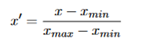

= Spezielle DB Themen

== Begriffe

* *Baseline:* Basis ML-Modell zum Vergleich mit folgenden Modellen
* *Hyperparameter:* Parameter eines ML-Algorithmus, die nicht durch Ändern der Trainingsdaten angepasst werden
* *Imbalance Dataset:* Unausgewogene Datensätze sind solche, bei denen die Klassenverteilung stark verzerrt ist, wie z. B. 1:100 oder 1:1000 Beispiele in der Minderheitsklasse zur Mehrheitsklasse. Diese Verzerrung im Trainingsdatensatz kann viele Algorithmen des maschinellen Lernens beeinflussen, so dass einige die Minderheitenklasse vollständig zu ignorieren
* *Random Undersampling:* zufälliges Löschen von Eintragen in der Mehrheitsklasse
* *Random Oversampling:* zufälliges Duplizieren von Einträgen in der Minderheitsklasse
* *Overfitting:* Modell orientiert sich zu sehr an den Trainingsdaten
* *Underfitting:* Modell berücksichtigt die Zusammenhänger der Daten nicht ausreichend

== Preprocessing

*Dataframes:* kleine Tabellen

*Series:* repräsentiert eine Spalte

=== Dealing with missing values

ML-Algorithmen können nicht mit fehlenden Werten umgehen daher muss man die Daten Vorverarbeitung

*Dropping*

* Einfachste Methode, aber möglicher Verlust von wichtigen Daten
* Kommt auf das dataset drauf, ob das Löschen der Zeile sinnvoll ist
** Sinnvoll: wenn nur einige wenige Zeilen betroffen sind
** vice versa, sinnlos wenn dadurch eine Großzahl der Zeilen gelöscht wird
* In Betracht ziehen on Löschen der Spalte mehr Sinn ergibt

*Imputing*

* Null-Werte durch generierte Werte ersetzen
* Methoden: Durschnitt, Median, am öftesten vorkommend
* Mit scikit-learn Bibliothek SimpleImputer verwenden

*Imputing with Flag*

* Wenn die ersetzenden Werte zu ungenau sind
* Man teilt dem Algorithmus mit, welche Werte von Anfang an gefehlt haben
** Man hängt dem Spaltennamen „was_missing“ an

*Categorical Variables*

* Kategoriale Daten sind Daten, die dazu dienen, Informationen mit ähnlichen Merkmalen zu gruppieren
* Fehlende kategorische Daten können mithilfe von Imputing-Methoden wir most-frequent und constant ersetzt werden

*Encoding Categorical Variables*

* Da die meisten ML-Algorithmen nichts mit kategorischen Daten anfangen können, müssen diese in numerische umgewandelt („encoding“) werden
* Ordinale Daten: Kategorien mit natürlicher Ordnung (Schulnoten)
** Ordinal Encoding: mit scikit-learn OrdinalEncoder
* Nominale Daten: Daten ohne quantitativen Wert (Haarfarbe, Augenfarbe)
** One-Hot Encoding: da Nominale Daten keine Ordnung haben wäre es irreführend, wenn man ihnen durch Ordinal Encoding einen Rang geben würde
* Durch binarisieren (von Kategorie Farbe zu isRed, isGreen, etc.)

*Scaling*

Bei Verwendung von distanzbasierten Algorithmen, spielt die Skalierung und Proportionalität der Features eine große Rolle.

* Min-max-normalisation: bringt die Daten in einen Bereich zwischen 0 und 1 (Ausreißer haben noch Einfluss)

