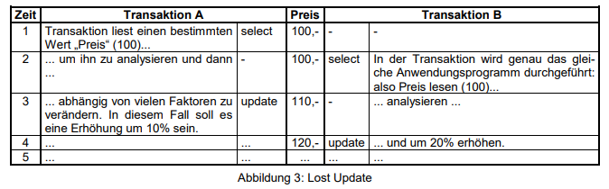
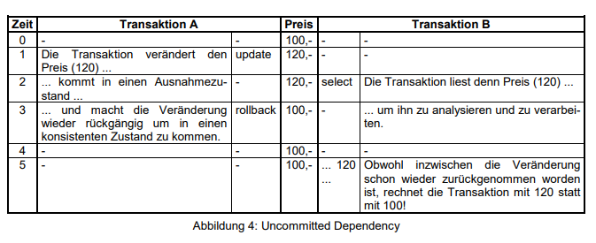
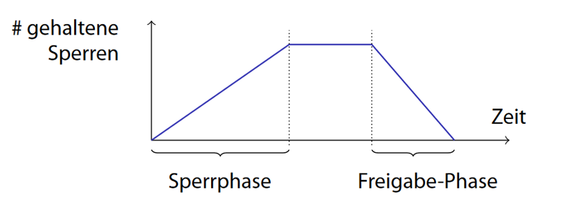
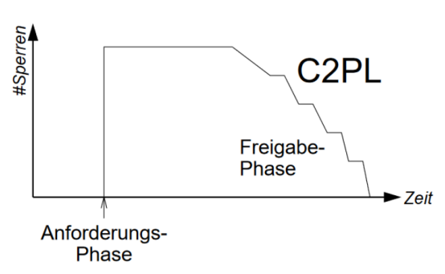
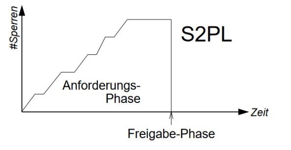

= Die "Multiuser-Eigenschaft" von Datenbanken und Concurrency

== Einleitung

Probleme mit der Concurrency (engl. Gleichzeitigkeit) in Datenbanksystemen treten immer dann auf, wenn „gleichzeitig“ mehrere Benutzer oder Prozesse auf die Datenbank zugreifen können.

Wird dabei auf die gleichen Daten-Items zugegriffen, so muss dies vom Datenbankmanagementsystem (DBMS) kontrolliert werden.

Fehlt ein geeigneter Kontrollmechanismus, so können inkonsistente Zustände in Datenbanksystemen auftreten.

== ACID

*  Atomicity:
** Entweder werden alle oder keine Werteänderungen einer Transaktion in den Datenbankzustand übernommen
* Consistency:
** Eine Transaktion überführt einen konsistenten Zustand (FDs, Integritätsvedingungen) in einen anderen
* Isolation:
** Eine Transaktion berücksichtigt bei der Berechnung keine Effekte andere parallel laufender Transaktionen
* Durability:
** Effekte einer erfolgreichen Transaktion werden persistent gemacht

== Locks

Die meisten DBMS sind Multiuser-Systeme, was bedeutet, dass es erlaubt ist, dass mehrere Transaktionen zur selben Zeit an der gleichen Datenbank ablaufen.

In solchen Systemen wird ein Concurrency Kontrollmechanismus benötigt, damit sich zeitlich parallel ablaufende Transaktionen gegenseitig nicht beeinträchtigen.

Ohne einen solchen Mechanismus können verschiedene Probleme auftreten. Diese typischen Probleme wollen wir nun betrachten:

=== Problem „Lost Update“

Eine Transaktion A holt einen Datensatz R zur Zeit t1. Transaktion B holt den gleichen Datensatz zu einem späteren Zeitpunkt t2.

Die Transaktion A schreibt den veränderten Datensatz zur Zeit t3 zurück und die Transaktion B schreibt den gleichen Datensatz gemäß den getätigten Veränderungen basierend auf den Werten, die zum Zeitpunkt t2 gültig waren, zum Zeitpunkt t4 zurück. Damit ist das Update der Transaktion A verlorengegangen.

Obwohl der Preis von ATS 100,- einmal um 10% und einmal um 20% erhöht werden sollte, was zu einem Preis von ATS 132,- führt, steht in der Datenbank ein Preis von 120,-; die Veränderung der Transaktion A ist verloren gegangen!

=== Problem “Uncommitted Dependency”

Dieses Problem tritt auf, weil die Transaktion B den Wert / Datensatz / Tabelle verwendet (select, update), der von der anderen Transaktion A zwar verändert, aber nicht committed wurde. Ein derartiges *„dirty read“* (= lesen, vor der Änderungsbestätigung) kann verhindert werden, in dem „uncommited updates“ vor anderen Transaktionen verborgen werden.

== Dirty Read

*Daten welche in einer noch nicht geschlossenen Datenbank liegen werden gelesen*

== Dirty Write

*Wenn zwei Transaktionen sich "vermischen" (Daten von mehreren Transaktionen sich kreuzen)*

== Sperren

* Sperren werden in Datenbanksystemen eingesetzt, um die Forderung der Isolation des ACID-Prinzips bei Transaktionen zu erfüllen
* Alle Sperrverfahren fallen in die Kategorie der pessimistischen Synchronisationsverfahren

== Two Phase Locking

Das 2PL-Verfahren geht davon aus, dass jede Transaktion zwei Phasen durchläuft:

* Die Wachstumsphase, in welcher Sperren nur gesetzt, aber nicht freigegeben werden dürfen.
* Die Schrumpfungsphase, in welcher Sperren nur freigegeben, aber nicht angefordert werden dürfen.

=== Spezialfälle von 2PL

==== Konservative 2PL (Preclaiming)

* Hier werden bei Beginn der Transaktion alle benötigten Sperren auf einmal gesetzt
* Verhindert Deadlocks
* Hoher Verlust an Parallelität, da Transaktion erst beginnen kann, wenn sie alle Sperren erhalten hat
* Es kann bei dieser Variante bereits vor Ende der Transaktion mit der Freigabe gesperrter Objekte begonnen werden.

==== Strikte 2PL

* Hier werden
* verhindert das kaskadierende Zurücksetzen von sich gegenseitig beeinflussenden Transaktionen
* Nachteil ist, dass Sperren häufig viel länger gehalten werden als nötig und sich somit die Wartezeit von blockierten Transaktionen verlängert

=== Timeout

* Einfach und Billig
* Wird für Deadlock-behandlung verwendet
* Wenn Transaktion ein Zeitlimit überschreiten wird ein Rollback durchgeführt
** Problem: Bestimmen des Timeout Grenzwertes schwierig
*** Zu hoher Wert: unnötige Wartezeit
*** Zu kleiner Wert: unnötige Rollbacks
* Wichtige Faktoren bei der Wahl des Wertes
** Lastzusammensetzung
** Konfliktwahrscheinlichkeit
** Verfügbarkeit und Auslastung der Rechner

== Fragen

====
*Referat: Concurrency*

*Consistency:*

Es hat nie einen Zustand, der nicht ungleich ist.

Keine zwei Tumfarts in einer Tabelle.

*Frage:* Welches gegenstück gibt es zu ACID bei anderen Datenbanken?

NoSQL gibt es kein ACID.

*Antwort:* CAP-Theorem

*Frage:* Wie schreibt man ein beginn und ende bei einer Transaction?

*Begin:* Gibts keinen | Ist der letzte Commit +
*Ende:* Commit

*Frage:* Wie aborted man?

*Keine Antwort bekommen*

*Frage:* Was sind R Sperren (Wird wrsl nicht gefragt)

*R* Sperren sind `Read Sperren` +
*RX* sind Read und `Write Sperren`

*Frage:* Welche Sperren kann man in Oracle stellen? (?)

* Lock Escalation

*Frage:* Wie kann man Probleme lösen

*Antwort:* Isolation-ebenen

*Frage:* Was kann aber doch noch Passieren

*Antwort:* Deadlock

*Frage:* Kann bei der Oracle DB einen Deadlock erstellen

*Antwort:* Ja

*Frage:* Wie löst Oracle einen Deadlock

*Antwort:* Wir selber müssen nichts machen, wird mit timeouts gelöst.
====